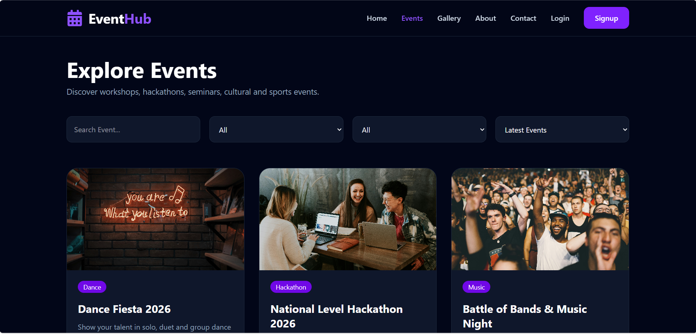
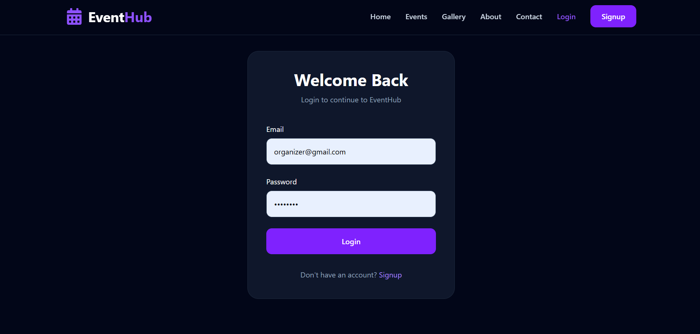
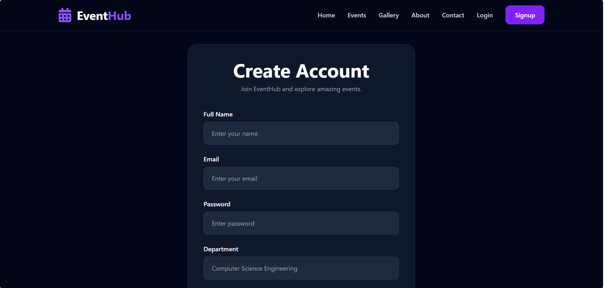
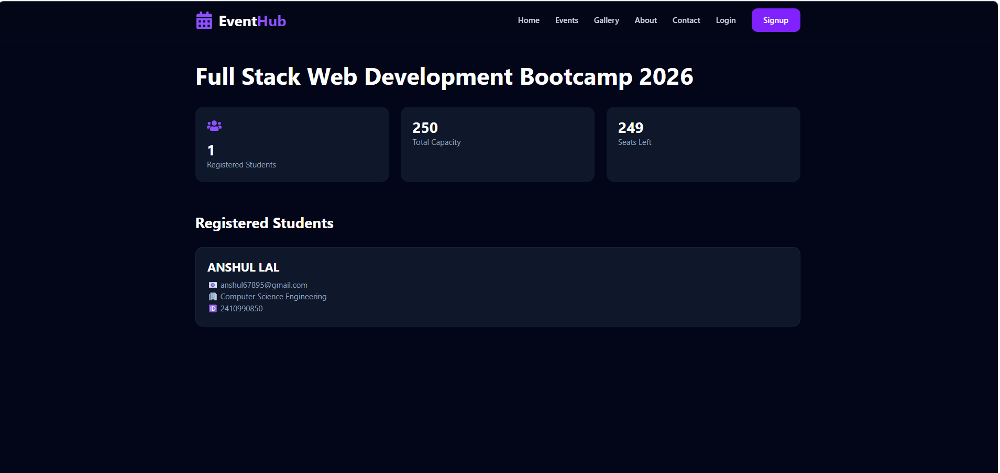
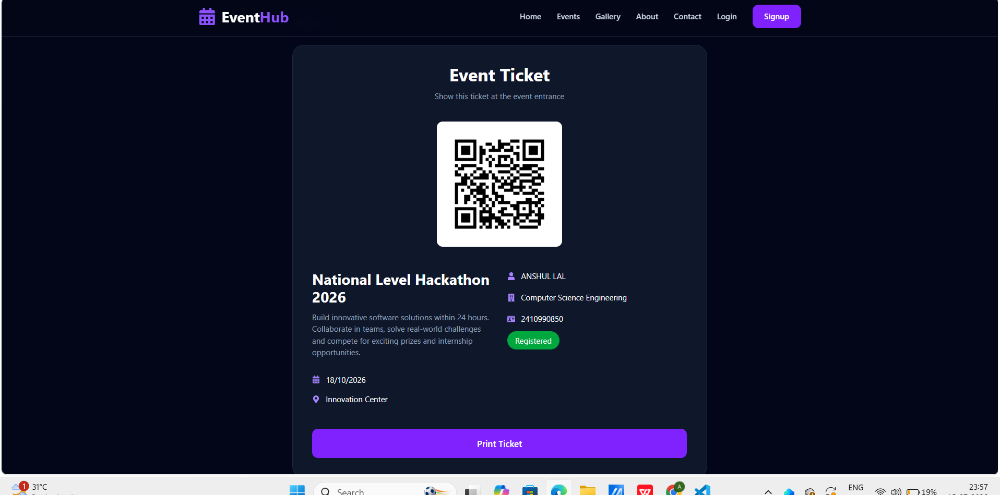
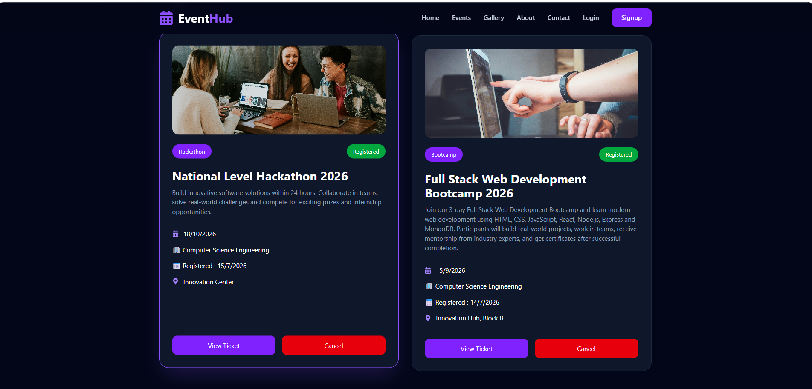
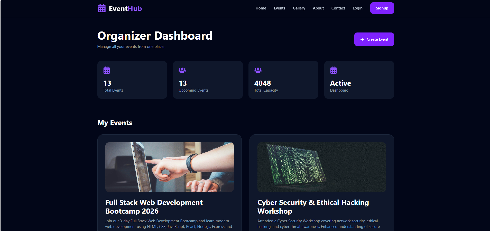
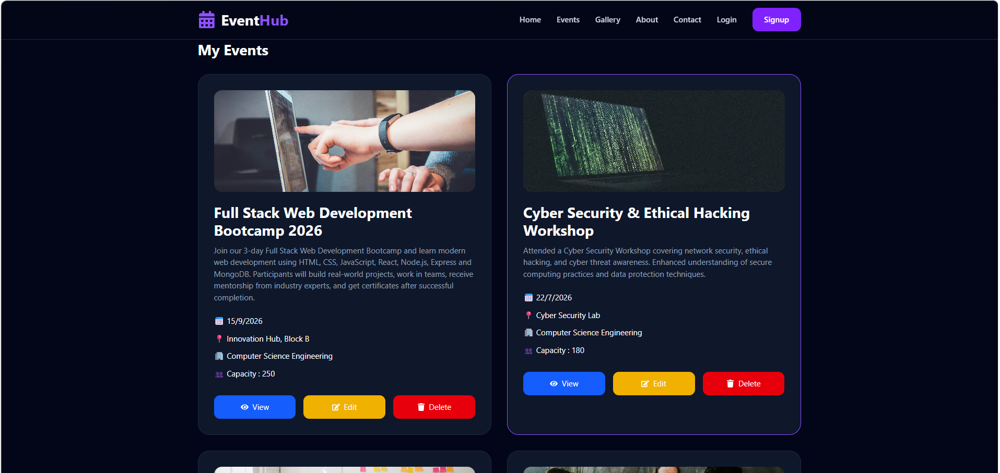
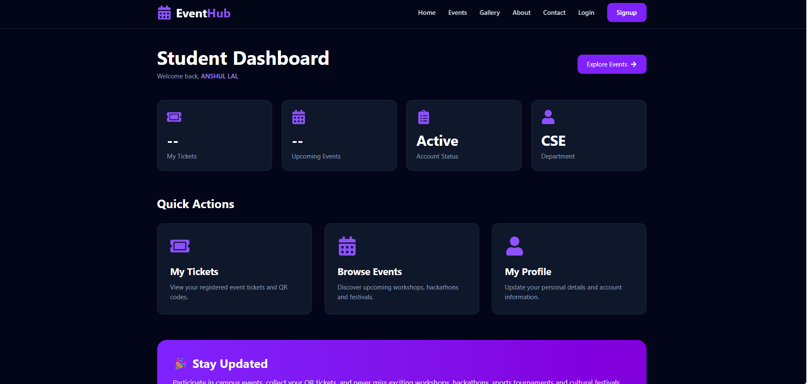

# 🎉 EventHub – Campus Event Management Platform

> A modern full-stack web application that simplifies campus event management with secure authentication, online event registration, QR-based tickets, and organizer dashboards.

---

## 🚀 Live Demo

🔗 Live Website: *(Add after deployment)*

---

# 📌 Project Overview

EventHub is a campus event management platform where students can discover events, register online, receive QR-based digital tickets, and manage their registrations.

Organizers can create events, edit/delete them, monitor registrations, and manage participants through a dedicated dashboard.

---

# ✨ Features

## 👨‍🎓 Student

- User Registration & Login
- Browse Upcoming Events
- Search & Filter Events
- Register for Events
- QR Code Ticket Generation
- View / Print Digital Ticket
- Cancel Registration
- Student Dashboard
- My Tickets

---

## 👨‍💼 Organizer

- Organizer Login
- Create Event
- Edit Event
- Delete Event
- Organizer Dashboard
- View Registered Students
- Event Statistics
- Seat Management

---

## 🌐 Public

- Home
- Events
- Gallery
- About
- Contact
- Responsive UI

---

# 🛠 Tech Stack

## Frontend

- React.js
- Tailwind CSS
- React Router DOM
- Axios

## Backend

- Node.js
- Express.js
- JWT Authentication
- bcryptjs

## Database

- MongoDB
- Mongoose

## Others

- QR Code Generator
- Git & GitHub

---

# 📸 Screenshots

## 🏠 Home


---

## 🎉 Events




---

## 🖼 Gallery


---

## 🔐 Login



---

## 📝 Signup



---

## 📋 Registered Students



---

## 🎟 QR Ticket



---

## 🎫 My Tickets



---

## 👨‍💼 Organizer Dashboard





---

## 👨‍🎓 Student Dashboard



---

# ⚙ Installation

Clone the repository

```bash
git clone https://github.com/anshul13-hub/EventHub.git
```

Move inside project

```bash
cd EventHub
```

Install Frontend

```bash
cd client
npm install
```

Install Backend

```bash
cd ../server
npm install
```

Run Backend

```bash
npm run dev
```

Run Frontend

```bash
cd ../client
npm run dev
```

---

# 📂 Folder Structure

```text
EventHub
│
├── client
│   ├── src
│   ├── public
│   ├── assets
│   ├── components
│   ├── pages
│   └── services
│
├── server
│   ├── config
│   ├── controllers
│   ├── middleware
│   ├── models
│   ├── routes
│   ├── utils
│   └── server.js
│
├── screenshots
│   ├── image.png
│   ├── image-1.png
│   ├── image-2.png
│   └── ...
│
└── README.md
```

---

# 🔐 Authentication

- JWT Authentication
- Password Hashing using bcryptjs
- Protected Routes
- Role-Based Access Control

---

# 📈 Future Improvements

- Email Notifications
- Attendance Scanner
- Certificate Generation
- Google Login
- Payment Gateway
- Admin Dashboard
- Event Analytics
- Calendar Integration

---

# 💡 Learning Outcomes

During this project I learned:

- Full Stack Development
- REST API Development
- JWT Authentication
- MongoDB CRUD Operations
- React State Management
- Protected Routes
- Responsive UI
- QR Code Integration
- Git & GitHub Workflow

---

# 👨‍💻 Author

**Anshul Lal**

B.Tech CSE Student

GitHub: https://github.com/anshul13-hub

---

# ⭐ Support

If you found this project helpful, please give it a ⭐ on GitHub.